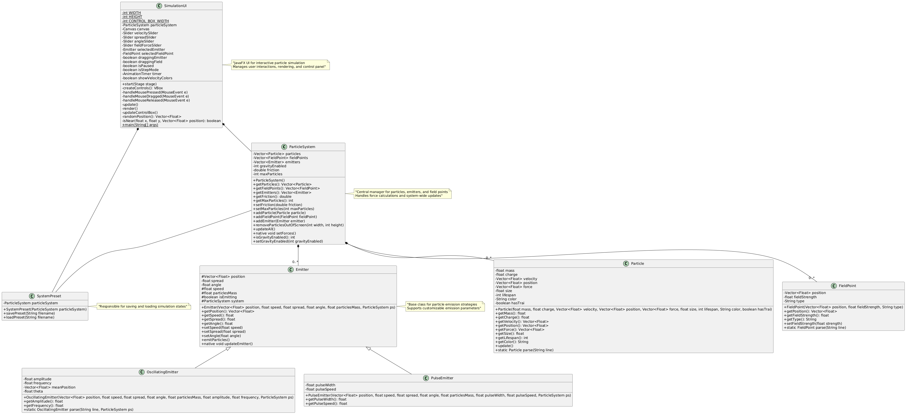
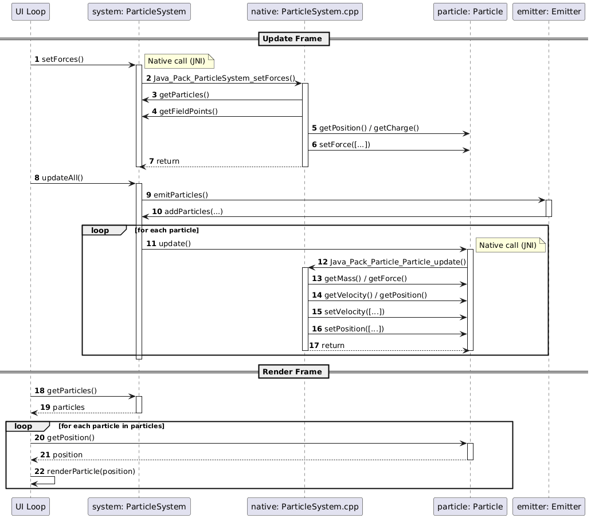
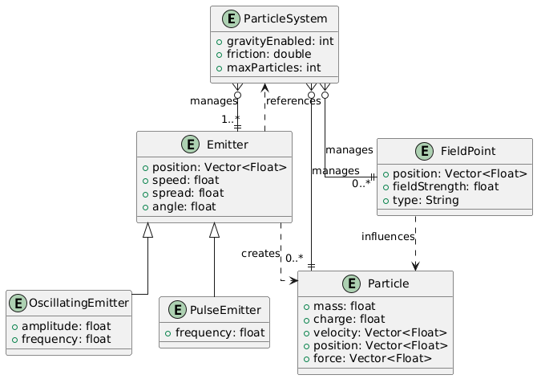
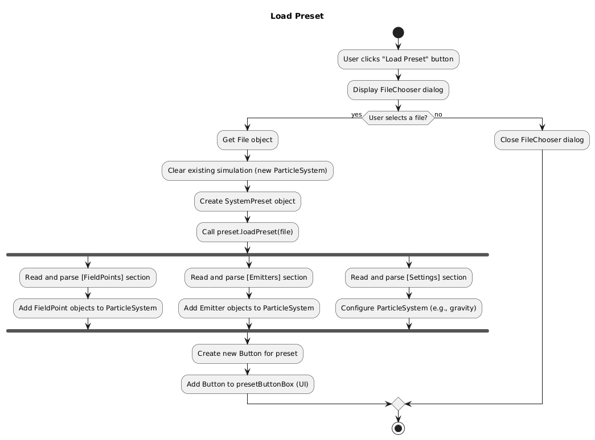
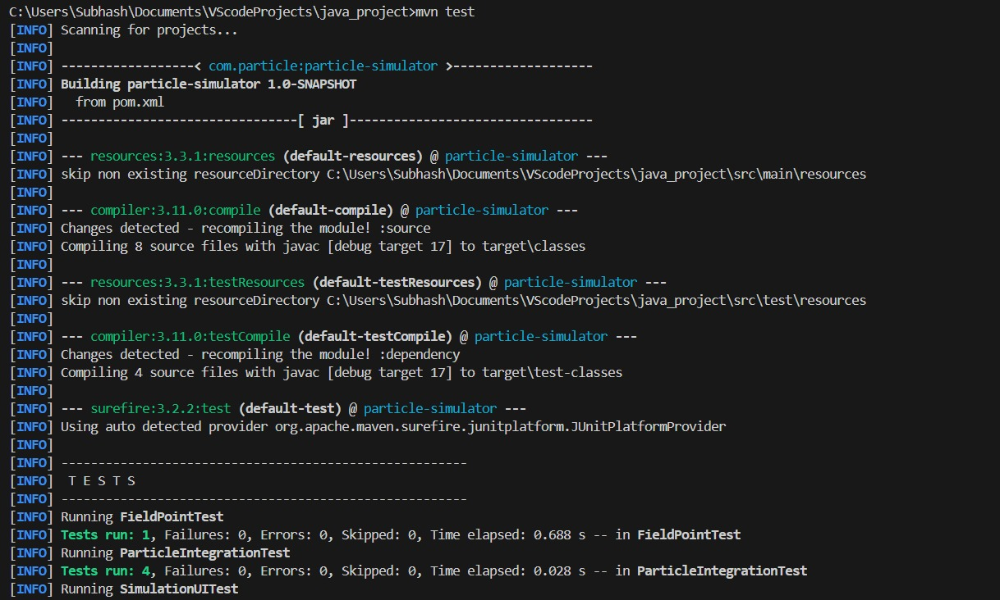
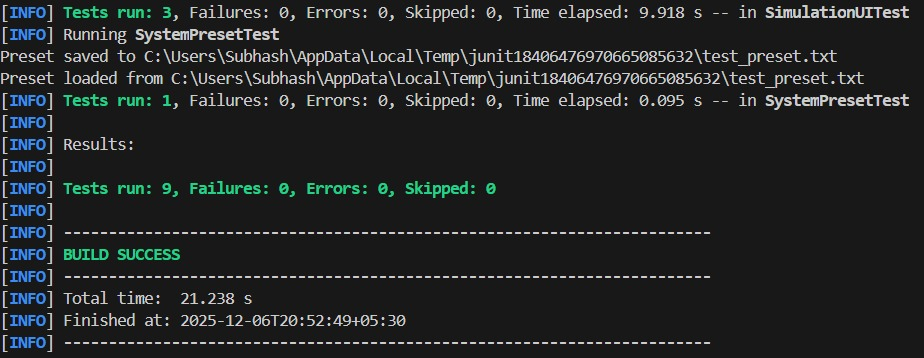

# Particle System Simulator

A high-performance, real-time application for modeling and visualizing complex particle dynamics using a hybrid Java (Frontend) + C++ (Backend) architecture.

**Team:** MYTHilesh
**Members:**
*   IMT2023085 Vaishak Prasad Bhat 
*   IMT2023104 Subhash Hari
*   IMT2023507 Mithilesh
*   IMT2023032 Dhruv Ramesh Joshi

## 1. Project Overview
The **Particle System Simulator** is a high-performance, real-time application designed to model and visualize complex particle dynamics. Developed as a comprehensive Software Engineering project, it demonstrates a **Hybrid Client-Server style architecture** where the "Client" (JavaFX Frontend) handles visualization and interaction, while the "Server" (C++ Backend) executes computationally intensive physics integration.

The system is designed for both educational analysis of vector mechanics and creative exploration of emergent behaviors, bridging the gap between high-level object-oriented design and low-level memory management via the **Java Native Interface (JNI)**.

---

## 2. Key Features

### Interactive Simulation Environment
* **Dynamic Emitters**: Supports polymorphic emitter types:
    * *Standard Emitter*: Constant stream with configurable velocity, spread, and angle.
    * *Oscillating Emitter*: Sinusoidal motion controlled by amplitude and frequency parameters.
    * *Pulse Emitter*: Rhythmic particle bursts based on time-step frequency.
* **Force Field Manipulation**:
    * *Attractors*: Inverse-square law gravitational points.
    * *Repulsors*: Inverse-square law repulsion fields.
* **Real-time Visualization**:
    * Velocity-based color interpolation (Gradient mapping from low to high kinetic energy).
    * Trajectory visualization.

### Global System Controls
* **Environment Physics**: Toggleable global gravity ($9.8 m/s^2$) and friction coefficients.
* **Time Control**: Pause, Resume, and "Step-Forward" functionality for frame-by-frame debugging.
* **System Reset**: Instant clearing of memory and canvas for new simulation states.

### Persistence Layer
* **Serialization**: Custom text-based serialization format for saving simulation states.
* **State Recovery**: Robust loading mechanism to reconstruct object graphs (Emitters, Fields, Settings) from disk.

---

## 3. Tech Stack

### Frontend & Application Logic
* **Framework**: JavaFX 21 (OpenJFX)
* **Language**: Java 17
* **Build Tool**: Apache Maven
* **UI Architecture**: Scene Graph / Event-Driven

### Backend & Physics Engine
* **Language**: C++17
* **Interface**: JNI (Java Native Interface)
* **Compiler**: GCC/G++ (MinGW on Windows)
* **Math**: Vector calculus, Semi-implicit Euler Integration

### Quality Assurance
* **Unit Testing**: JUnit 5
* **Integration Testing**: JUnit 5 + JNI Bridge
* **UI Automation**: TestFX, Hamcrest Matchers

---

## 4. Software Architecture

The application implements a **Layered Hybrid Architecture**, separating concerns based on computational cost and abstraction level.

### 1. Presentation Layer (JavaFX)
Responsible for the **View** and **Controller** aspects. It manages the Scene Graph, captures user input events (Mouse/Keyboard), and orchestrates the rendering loop (`AnimationTimer`). It remains decoupled from the physics logic to ensure UI responsiveness.

### 2. Abstraction Layer (Java Domain)
Contains the high-level Object-Oriented representations of system entities (`Particle`, `Emitter`, `FieldPoint`). This layer acts as a **Proxy**, maintaining the state required for serialization and UI binding, while delegating actual state mutation to the native layer.

### 3. Native Interface Layer (JNI)
Acts as the **Adapter** between the Java Virtual Machine (JVM) and the native runtime. It handles data marshalling (converting Java `Vectors` to C++ `std::vector`) and memory pinning.

### 4. Computation Layer (C++)
The "Engine" of the application. It implements a **Data-Oriented Design** approach for performance. It iterates over contiguous memory arrays to calculate forces and update positions using numerical integration, minimizing cache misses.

---

## 5. UML & Analysis Models

### Class Diagram
The system structure emphasizes composition. The `ParticleSystem` acts as the central manager, aggregating heterogenous collections of `Emitters` and `FieldPoints`.



### Sequence Diagram (Update Loop)
This diagram illustrates the critical path of a single simulation frame, highlighting the context switch between the Java UI thread and the C++ execution block.



### Entity-Relationship (ER) Diagram
Illustrates the data relationships and cardinality between the core entities managed by the system.



### Activity Diagram (Persistence)
Details the control flow for the "Load Preset" use case, involving file parsing, object factory creation, and system state injection.



---

## 6. Design Patterns Utilized

1.  **Facade Pattern**: The `ParticleSystem` class provides a unified interface to a set of interfaces in the subsystem (Particles, Emitters, Fields), making the subsystem easier to use for the `SimulationUI`.
2.  **Game Loop Pattern**: Implemented via JavaFX `AnimationTimer`. It decouples the progression of game time from user input, ensuring consistent physics updates.
3.  **Strategy Pattern (Native)**: The C++ backend employs different calculation strategies for fields based on their type (Attractor vs. Repulsor) without altering the particle's update method.
4.  **Factory Method**: The `parse()` methods in `Emitter` and `FieldPoint` classes serve as static factories to instantiate objects from serialized string data.
5.  **Observer Pattern**: Used extensively in the UI layer; Sliders and Buttons attach listeners to model properties to trigger real-time updates.

---

## 7. Project Structure

```text
Project Root
├── pom.xml                                      # Maven Project Object Model
├── ParticleSystem.dll                           # Compiled Native Physics Engine
├── src/
│   ├── c++/                                     # --- NATIVE LAYER ---
│   │   ├── ParticleSystem.cpp                   # Physics implementation & JNI exports
│   │   └── headers/                             # JNI generated header files
│   │
│   └── custom/Pack/                             # --- APPLICATION LAYER ---
│       ├── SimulationUI.java                    # Entry Point, Layouts, Event Handling
│       ├── ParticleSystem.java                  # Facade & JNI Declarations
│       ├── SystemPreset.java                    # Persistence / Serialization Logic
│       │
│       ├── Emitter/                             # Emitter Polymorphism
│       │   ├── Emitter.java                     # Base implementation
│       │   ├── OscillatingEmitter.java          # Sinusoidal behavior extension
│       │   └── PulseEmitter.java                # Time-based behavior extension
│       │
│       ├── FieldPoint/
│       │   └── FieldPoint.java                  # Force field entity
│       │
│       └── Particle/
│           └── Particle.java                    # Particle entity & JNI update bridge
│
└── test/                                        # --- QA LAYER ---
    ├── FieldPointTest.java                      # Unit Tests (Logic)
    ├── ParticleIntegrationTest.java             # Integration Tests (Physics/JNI)
    ├── SystemPresetTest.java                    # Persistence Tests (I/O)
    └── SimulationUITest.java                    # UI Automation Tests (TestFX)
```
---

## 8. Testing Strategy

The project utilizes a comprehensive **Pyramid Testing Strategy**, ensuring reliability from the lowest logic units up to the user interface.

### Unit Testing (Logic & Data)
* **Objective**: Verify the integrity of data parsing and string manipulation without external dependencies.
* **Scope**: `FieldPoint`, `SystemPreset`.
* **Methodology**: Boundary value analysis on input strings to ensure the parser handles malformed data gracefully.
* **Framework**: JUnit 5, Hamcrest assertions.

### Integration Testing (Physics & JNI)
* **Objective**: Verify the correctness of the Java-to-C++ bridge and the accuracy of physics calculations.
* **Scope**: `Particle`, `ParticleSystem`.
* **Methodology**:
    * **Gravity Verification**: Assert that a particle with `mass=1.0` receives exactly `0.1` downward force/frame.
    * **Attraction Accuracy**: Place a particle and an attractor at fixed coordinates and assert the force vector matches the inverse-square law formula calculated manually.
    * **Memory Safety**: Ensure repeated calls to native methods do not cause JVM crashes (Segmentation Faults).

### System/UI Testing
* **Objective**: Validate the application flow and UI responsiveness.
* **Scope**: `SimulationUI`.
* **Methodology**: Headless UI automation using **TestFX**. A robot simulates user interactions (clicking "Add Emitter", dragging sliders) to ensure the application state transitions correctly without exceptions.

---

## 9. Test Execution & Results

The following images document the successful execution of the project's comprehensive test suite using the `mvn test` command.




---

## 10. Setup and Execution Guide

### Prerequisites
* **Java JDK 17** or higher.
* **Apache Maven** (3.6+).
* **G++ Compiler** (MinGW for Windows, GCC for Linux).

**Windows (PowerShell/CMD):**

### Step 1: Compile Native Library 

The C++ backend must be compiled into a shared library (`.dll` or `.so`) before the Java application can run

```cmd
g++ -I"%JAVA_HOME%\include" -I"%JAVA_HOME%\include\win32" -shared -o ParticleSystem.dll src/c++/ParticleSystem.cpp
```

### Step 2: Run Test Suite
Execute the Maven test cycle to verify the build and physics engine integrity.

```cmd
mvn test
```

### Step 3: Launch Application
Run the application using the Maven JavaFX plugin.

```cmd
mvn javafx:run
```
